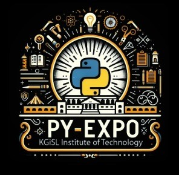

---

## Problem Statement

*Problem Statement ID – PY041*

Many two-wheeler riders violate traffic rules by not wearing helmets, leading to increased road accidents and fatalities. Additionally, identifying such violations and capturing the corresponding vehicle details manually is inefficient and error-prone. The challenge is to develop a system that can automatically detect riders without helmets in real-world traffic conditions, capture their vehicle's license plate, and extract the plate number for further processing. This must be done accurately despite variations in lighting, motion blur, occlusions, and complex urban traffic scenarios.
..

---

## Overview
The solution utilizes a deep learning-based object detection model to identify riders without helmets and capture their vehicle's license plate. The system works as follows:

Helmet Detection – A trained YOLO-based model processes video feeds to detect riders and classify them as wearing or not wearing helmets.

License Plate Detection – If a violation is detected, the system isolates the vehicle’s license plate from the frame.

Text Extraction – Optical Character Recognition (OCR) or AI-based text recognition extracts the license plate number from the detected plate.

Data Logging – The detected violations, along with the timestamp and extracted plate number, are stored for further analysis and legal action.
The system aims to improve traffic rule enforcement, reduce manual effort, and enhance road safety by ensuring strict adherence to helmet laws.

---

## Team Members

*Team ID – T001
List your team members along with their roles.

- *Joe Daniel A* - Team Leader
- *Akilan CK* - Machine Learning Engineer
- *Madhumitha A* - DataBase Administrator
- *Keerthana S* - Back-end Developer
- *Adarsh Ram K* - Back-end developer

---

## Technical Stack

Tech Stack:
1. Backend 
Django - Python web framework, is used for rapid development of secure and maintainable websites
OpenCV → For video processing and real-time detection
YOLOv8 (Ultralytics) → For helmet detection & license plate recognition
easy OCR → For extracting license plate text
2. Frontend
 HTML, CSS → For a simple dashboard to display results
3. Database (For Storing Results)
 MySQL → To store detected violations and plate numbers

---

## Getting Started

Follow these steps to clone and run the application locally.

### Prerequisites

1. Install [Python](https://www.python.org/downloads/).
2. Install [Git](https://git-scm.com/).
3. Clone this repository:
   bash
   git clone https://github.com/joedanields/T001-PROBLEMHUNTERS.git
   

### Installation

1. Navigate to the project directory:
   bash
   cd 
   
2. Create a virtual environment:
   bash
   python -m venv venv
   
3. Activate the virtual environment:
   - On Windows:
     bash
     venv\Scripts\activate
     
   - On macOS/Linux:
     bash
     source venv/bin/activate
     
4. Install dependencies:
   bash
   pip install -r requirements.txt
   
5. Navigate to source
   bash
   cd source
   

---

## Start the Application

1. Run the Django application:
   bash
   python manage.py runserver
   
2. Open your browser and navigate to:
   
   http://127.0.0.1:5000/
   

---

## UI Overview

Images to demonstrate the user interface:

*Example pages:*

1. *Landing Page:*
   

2. *Dashboard:*
   

3. *Analytics View:*
   

---

## Resources

### 📄 PowerPoint Presentation
[Click here to view the PPT]([https://docs.google.com/presentation/d/1AdohcYIEaekxf3y7AZnf9Uo_uB4WrVGFtCxf4rmY7Ns/edit?usp=sharing])

### 🎥 Project Video
[Click here to view the project demo video](insert-drive-link-here)

### 📹 YouTube Link
[Watch the project on YouTube](insert-youtube-link-here)

---
